# [💚 하나모아 - 소액으로 금·은·외환까지 투자할 수 있는 자산 플랫폼](https://www.hanamoa.co.kr/)

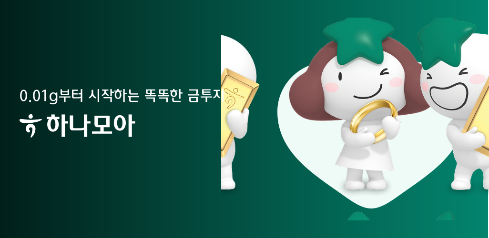

### 1. 프로젝트 소개

**목표**

> 기존 골드뱅킹 서비스의 단순 거래 중심 구조를 보완하고, 사용자 중심의 차별화된 디지털 투자 경험 제공함을 목표로 합니다.

### 2. 기획 배경

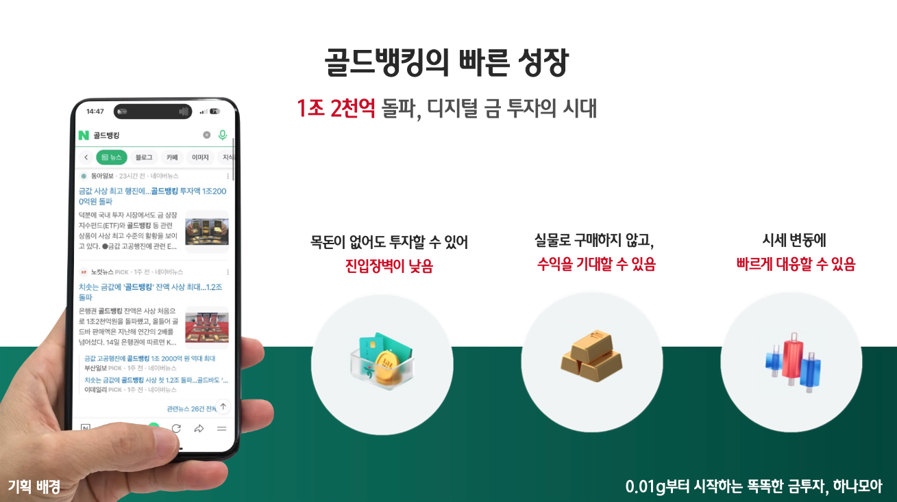

-   골드뱅킹 시장은 올해 투자액 1조 2천억 원을 돌파하며 빠른 성장세를 보이고 있습니다.
-   하지만 기존 골드뱅킹 서비스는 단순한 거래 기능에 머물러, 사용자 맞춤형 기능이 부족한 한계가 존재합니다.
-   이에 따라 누구나 쉽게 접근할 수 있는 스마트한 금, 은, 외환 투자 플랫폼을 기획·개발하게 되었습니다.

### 3. 핵심 아이디어

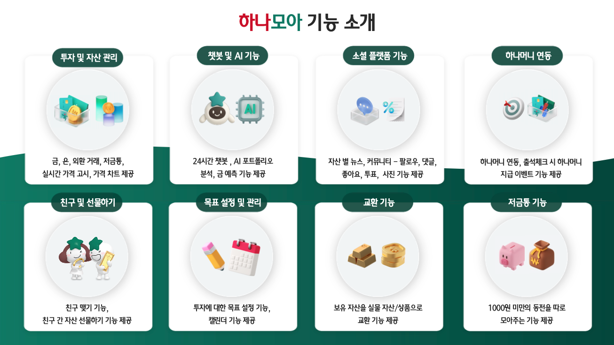

-   투자하기 : 자산 6종의 시장가·지정가 주문, 정기 매수 등 다양한 주문 방식 지원합니다.
-   커뮤니티 : 게시글 작성, 댓글, 좋아요, 이미지 업로드, 투표, 팔로우 등 사용자 간 소통 공간 제공합니다.
-   선물하기 : 보유한 자산을 친구 또는 미가입자에게 선물할 수 있습니다.
-   교환하기 : 보유한 자산을 실물 혹은 상품으로 교환할 수 있습니다.
-   저금통 : 매일 자정에 계좌 잔액의 1,000원 미만 금액을 자동으로 저금통에 적립할 수 있습니다.

### 4. 구현 기능

강화된 RAG 기반의 LLM 하이챗봇
    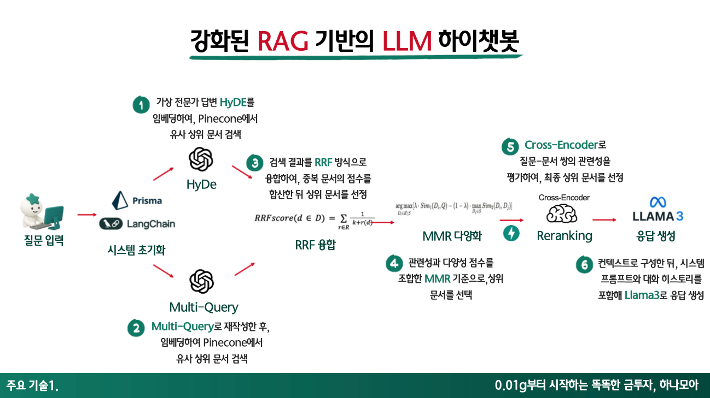

Spark Analytics Service 구축
    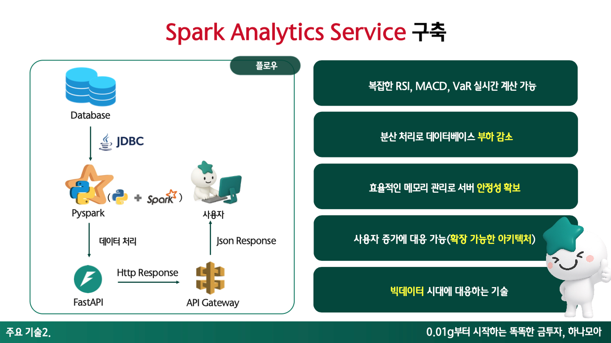

### 5. 시스템 아키텍처

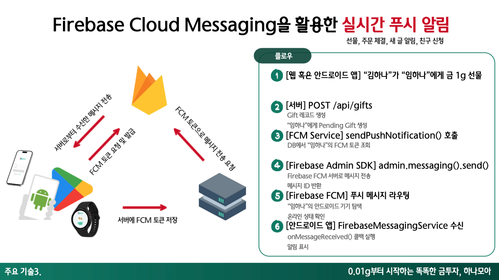

### 6. 스크린 샷

| 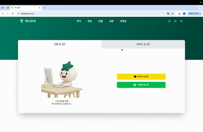 | 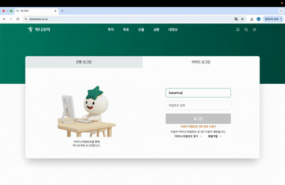 |
|:-------------------------:|:-------------------------:|
|         `로그인창`         |        `로그인하기`         |
| 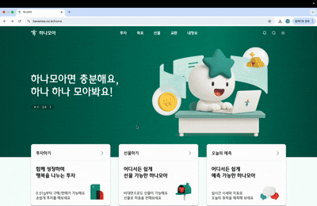 | 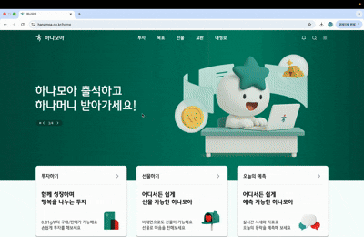 |
|         `홈화면`         |        `네비게이션 바`         |
| 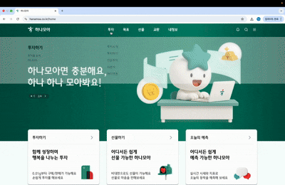 | 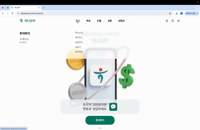 |
|         `투자소개`         |        `투자하기`         |
| 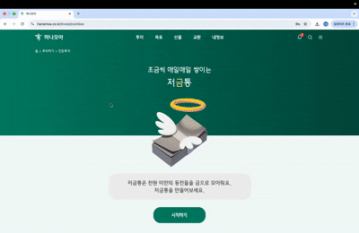 | 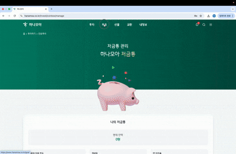 |
|         `저금통`         |        `목표`         |
|  | 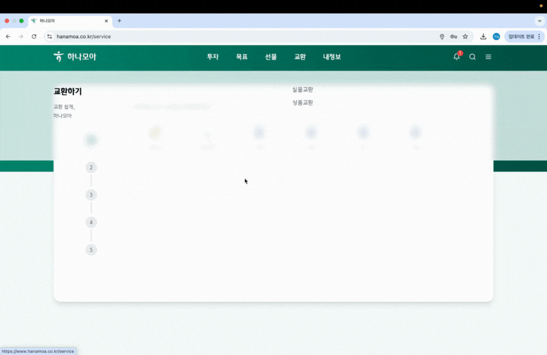 |
|         `선물하기`         |        `교환`         |
| 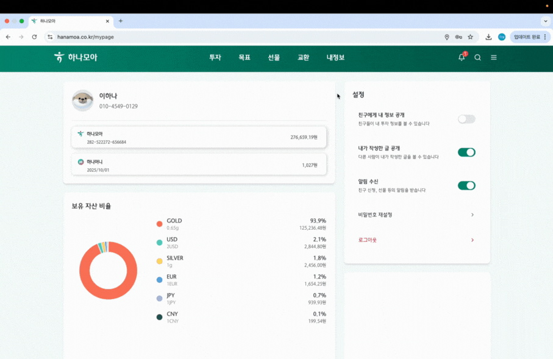 | 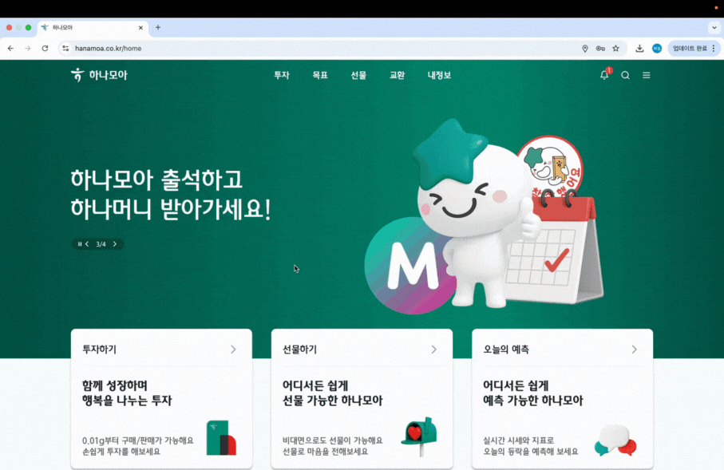 |
|         `마이페이지`         |        `출석체크`         |
